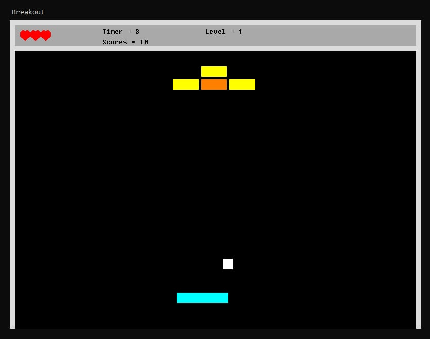

# C++ Console Breakout game for Windows

C++ Implementation Console Breakout game for Windows, with alternative block processing:
1) Yellow - break through without rebound
2) Orange - bounce in the opposite direction
3) Red - bounce back

The game has 3 levels, but there is a reading from the levels directory according to the pattern "levels/level" + number + ".txt".

Presented Use-case diagram and Classes diagram: use-case.pdf, class-diagram.pdf

​
